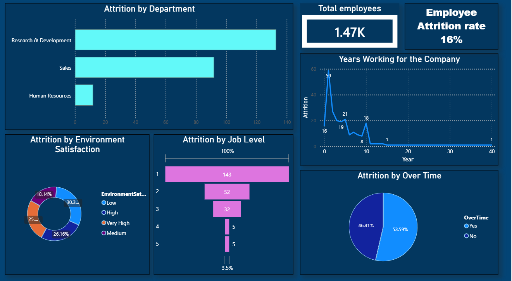
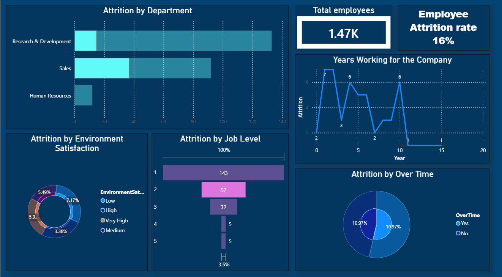

# IBM Employee Attrition Prediction And Analysis
An end-to-end employee attrition prediction project using imbalanced-learn pipeline, SMOTE, feature selection,
hyperparameter tuning and Power BI dashboard.

## Project Overview
This project analyzes employee attrition using the IBM HR Analytics Employee Attrition dataset. To identify
the key factors influencing employee attrition and predict whether an employee is likely to leave the organisation by 
combining **exploratory data analysis (EDA), model optimization technique and interactive dashboard.**

## Problem Statement
As employee attrition increases, identifying the primary contributers to attrition through predictive analytics helps organization optimize retention and reduce the financial burden of recruitment. 

## Dataset 
[Download](IBM-Employee-Attrition.csv)

The dataset contains the following features:

• Attrition (Target Variable)

          • Yes
   
          • No

• Demographic details of employees

• Department

• Job role

• Job satisfaction

• Monthly Income

• Work life balance

• Overtime status

• Education

• Performance Rating

• Years at company

• Years at current role

## Tools And Technologies
Python

Pandas

Matplotlib

Scikit-learn

Imbalanced-learn

Google Colab

Power BI

## Project Workflow
### 1. Data Preprocessing

• Load the dataset using Pandas

• Droped Unnecessary columns

• Encoded categorical variables using OneHotEncoder

• Standardize numerical features using StandardScaler

• Applied LabelEncoding on Target Variable

### 2. Handling Class Imbalance 
The dataset was highly imbalanced 

**Class Yes - 237**

**Class No - 1233**

SMOTE (Synthetic Minority OverSampling Technique) is used to generate Synthetic samples for the minority class.

### 3. Feature Selection
 **SelectKBest** is used to perform Feature Selection to retain the most informative features and to
avoid overfitting of the model.

### 4. Machine Learning Models
The following classifiers are trained and evaluated:

• Logistic Regression

• Decision Tree Classifier

• Support Vector Machine (SVM)

### 5. Hyperparameter Tuning
Model Performance is optimized using:

• GridSearchCV

• Stratified K-Fold Cross Validation

### 6. Model Evaluation
Performance metrics used:

• ROC-AUC Score

• Classification Report

## Data Visualization
The dashboard provides insights to important HR metrics and employee attrition pattern.

### Dashboard Preview

## Results and Conclusion
The project compare multiple machine learning models to determine the best performing classifier for employee attrition
prediction. Hyperparameter tuning and cross-validation are used to improve robustness and avoid overfitting. Logistic Regression performs the best
against the other classifiers with roc_auc score of **70.65%**

• Employee Attrition rate is **16%**

• The Research & Development department has the highest attrition cases, Sales been the second affected.

• Employees working overtime exhibit higher attrition.

• The attrition rate decreases as the Job Level Rises.

• Attrition is more among the employees working for over a year.

• Low Environment Satisfaction Employees have higher attrition.

